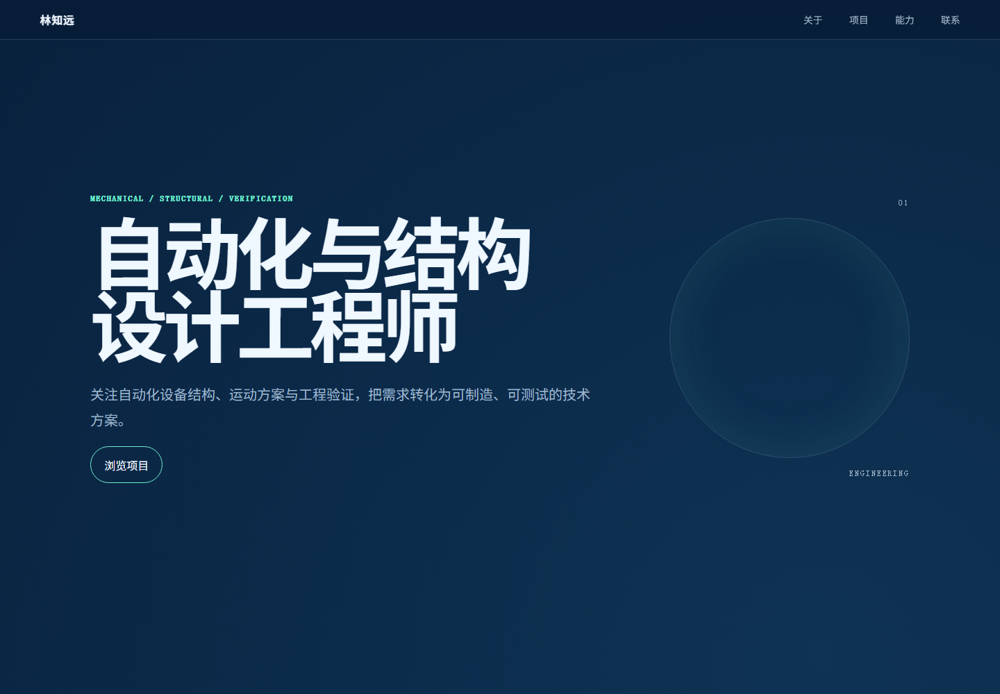
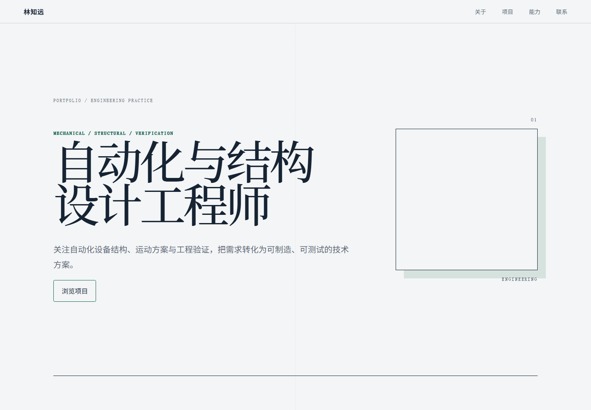

# Engineering Portfolio Builder

把工程师的简历、项目报告、论文、PPT、图纸和图片整理成有证据链的响应式个人作品集，并生成可上传到腾讯云 CloudBase 的静态网站压缩包。



## 能做什么

- 从 DOCX、PDF、PPTX、图片和用户补充说明中整理公开内容；
- 为简历中的每个项目生成“背景—问题—行动—成果”叙事；
- 把 CAD、仿真、结构图和照片放在其所支持的段落旁，而不是堆在文末；
- 同时生成 Technology Dark、Professional Light、Creative Visual 三套预览；
- 检查素材清晰度、缺失资源、路径安全、响应式布局和二维码；
- 在上传前逐项披露个人信息，并为腾讯云 CloudBase 生成根目录 ZIP。

它面向机械、结构、自动化、工业设计及其他技术岗位。仓库中的姓名、单位、项目和图均为虚构示例。

## 三套模板

| Technology Dark | Professional Light | Creative Visual |
|---|---|---|
| 深蓝、克制、科技感 | 明亮、编辑式、适合打印 | 非对称、图像主导、视觉记忆强 |
|  |  |  |

## 安装到 Codex

直接添加公开插件市场并安装：

```bash
codex plugin marketplace add mumu7830/engineering-portfolio-builder --ref main
codex plugin add engineering-portfolio-builder@engineering-portfolios
```

也可以先克隆仓库，再从本地添加插件市场：

```bash
git clone https://github.com/mumu7830/engineering-portfolio-builder.git
cd engineering-portfolio-builder
codex plugin marketplace add .
codex plugin add engineering-portfolio-builder@engineering-portfolios
```

安装后新建一个 Codex 任务，并输入：

```text
请使用 $building-engineering-portfolios，把我的简历和项目材料整理成工程师作品集，先给我三套本地预览。
```

自然语言“把这些简历和论文做成腾讯云作品集”也可触发该 Skill。

## 隐私与发布边界

源简历、论文、二维码、联系方式和生成的私人网站不会进入本仓库。上传前必须展示准确的公开字段与文件清单，并在上传动作发生前再次确认。遇到付费套餐、自动续费、凭据输入或权限扩大时，流程会停止。

详见 [使用说明](docs/usage.md) 和 [隐私说明](docs/privacy.md)。

## 本地开发

需要 Node.js 24、pnpm 11 和 Chromium：

```bash
pnpm install --frozen-lockfile
pnpm exec playwright install chromium
pnpm validate
pnpm test:browser
```

仅用虚构示例生成成品：

```bash
pnpm portfolio:build -- --input examples/fictional-engineer/portfolio-data.json --template tech-dark --output generated/site
pnpm portfolio:package -- --site generated/site --output generated/fictional-cloudbase.zip
pnpm portfolio:qr -- https://portfolio.example.com/fictional-engineer/ generated/url.png
```

## License

[MIT](LICENSE)
